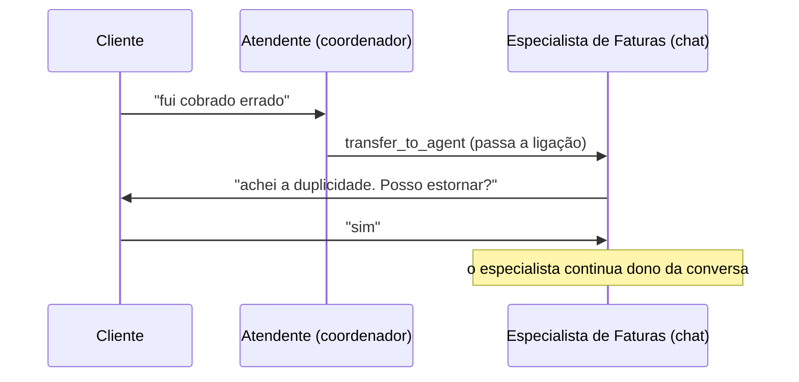
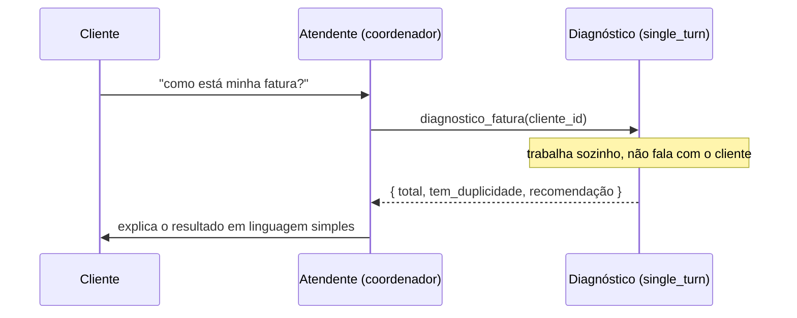
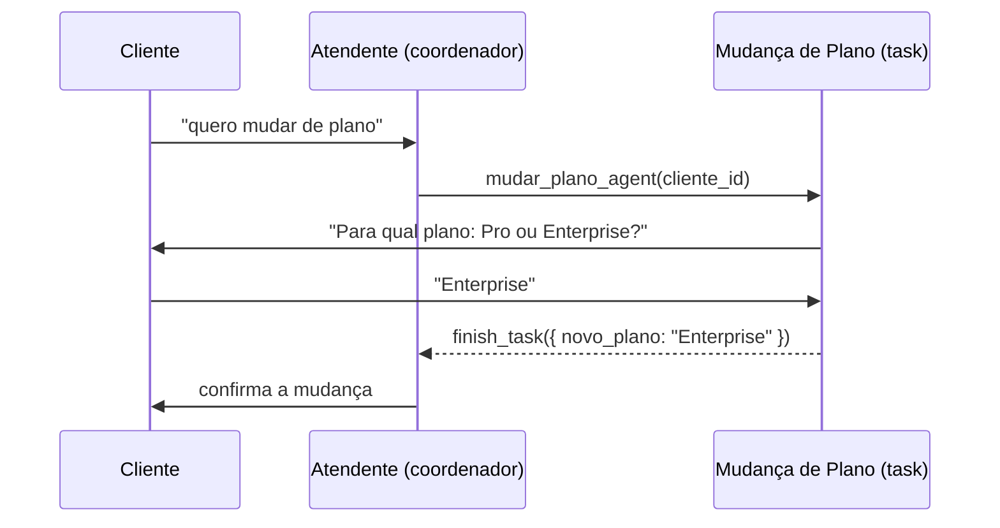
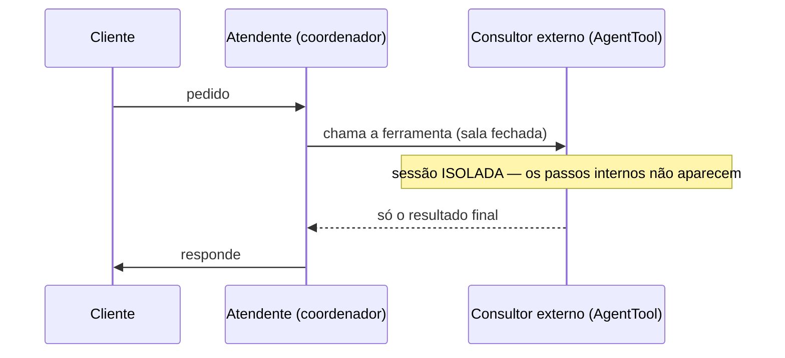

# Como agentes delegam tarefas no ADK — guia para aprender

---

## TL;DR — a página que resume tudo

No ADK, um agente "principal" (o **coordenador**) pode resolver um pedido sozinho **ou
delegar** a um especialista. Existem **4 jeitos** de delegar:

| Jeito | Analogia (atendimento) | Quem fala com o cliente | Quando usar |
|---|---|---|---|
| **`chat`** | **passar a ligação** | o **especialista** assume | conversa longa + **confirmação humana** |
| **`single_turn`** | pedir um **relatório** a um colega | só o coordenador | tarefa **autônoma** e estruturada |
| **`task`** | colega que **pode perguntar** algo | coordenador (colega esclarece) | tarefa estruturada que **pode precisar esclarecer** |
| **`AgentTool`** | **consultor externo** numa sala fechada | só o coordenador | **isolar**/sandbox/embrulhar agente externo |

Regra de bolso:
- Precisa que o especialista **converse** com o cliente em vários turnos (e/ou peça
  **confirmação humana**)? → **`chat`**.
- É uma **sub-tarefa** que o coordenador encomenda e recebe pronta? → **`single_turn`**
  (autônoma) ou **`task`** (se puder precisar esclarecer).
- Quer **esconder** o que o especialista faz por dentro (caixa-preta)? → **`AgentTool`**.

---

# Parte 1 — A intuição

## O problema que a delegação resolve

Imagine um agente único que faz **tudo**: responde fatura, mexe em assinatura, faz
estorno, muda plano… O _prompt_ dele vira um monstro: dezenas de regras e ferramentas
competindo. Ele erra mais, fica caro e é difícil de manter.

A saída é a mesma de uma empresa: **divisão de trabalho**. Um **atendente principal**
recebe o cliente e **encaminha** para **especialistas** focados. Cada especialista tem
um _prompt_ enxuto e só as ferramentas que precisa. É o **multi-agente**.

## A analogia que vamos usar no guia inteiro

> **A Acme tem um atendimento.** O **atendente principal** (o _coordenador_) recebe o
> cliente. Diante de um pedido, ele tem **3 saídas**:
>
> 1. **Resolver sozinho.**
> 2. **Passar a ligação** para um especialista, que aí fala **direto com o cliente**.
> 3. **Pôr o cliente em espera, consultar um colega nos bastidores e voltar** com a resposta.

A saída 2 é o padrão **`chat`**. A saída 3 são os padrões **tool-call**
(`single_turn`, `task`, `AgentTool`) — e os "bastidores" têm 3 sabores que veremos já já.

## A regra mais importante de todas

Um agente, no fundo, é só **três coisas**: um _prompt_ (a `instruction`), um conjunto de
**ferramentas** e um **modelo** de IA. Delegar = **trocar qual prompt está no comando** da
próxima resposta.

E atenção: **delegar não é obrigatório**. Se o cliente diz "bom dia", o atendente
responde direto — sem chamar especialista nenhum.

---

# Parte 2 — Os 4 padrões, um a um

Cada padrão segue o mesmo roteiro: **analogia → diagrama → quando usar → exemplo real**.

## Padrão 1 — `chat`: passar a ligação

**Analogia:** o atendente **transfere a ligação**. A partir daí, o **especialista assume**
e conversa direto com o cliente, quantos turnos forem precisos, até devolver a ligação.



**Como o coordenador chama:** com a ferramenta `transfer_to_agent`.

**Quando usar:**
- O especialista precisa **conversar** com o cliente (vários idas e voltas).
- Você precisa de **confirmação humana** dentro do especialista (ex.: "confirma o
  estorno?"). ⚠️ **`chat` é o caminho recomendado para confirmação humana** (o `task`
  também funciona, com um cuidado; ver Parte 4).


---

## Padrão 2 — `single_turn`: o relatório pronto

**Analogia:** o atendente põe o cliente em espera e **pede um relatório a um colega que
trabalha sozinho**. O colega **não fala com o cliente** — faz a análise e devolve o
resultado. O atendente volta e explica.



**Como o coordenador chama:** como uma **ferramenta** com o **nome do agente**
(ex.: `diagnostico_fatura(...)`). O coordenador **nunca larga o controle**.

**Entrada e saída são "formulários" (estruturados):** o coordenador manda os campos de
entrada (_input schema_) e recebe os campos de saída (_output schema_) — previsível,
fácil de usar no código.

**Quando usar:** uma sub-tarefa **autônoma** e bem definida: diagnosticar, classificar,
resumir, calcular. Nada de conversa.

---

## Padrão 3 — `task`: o colega que pode pedir um esclarecimento

**Analogia:** igual ao relatório do `single_turn`, **mas o colega pode fazer UMA pergunta
ao cliente** antes de entregar (ex.: faltou um dado). Depois fecha e devolve o resultado.



**Como o coordenador chama:** igual ao `single_turn` — ferramenta com o **nome do agente**.
A diferença é que o `task` **pode conversar** para esclarecer, e fecha chamando
`finish_task`.

**Quando usar:** uma tarefa estruturada que **pode precisar de uma informação extra** do
cliente antes de concluir (coletar dados, confirmar uma escolha).

---

## Padrão 4 — `AgentTool`: o consultor externo (caixa-preta)

**Analogia:** o atendente **terceiriza** para um **consultor externo numa sala fechada**.
Você manda o pedido, ele trabalha **isolado** e te devolve **só o resultado final** — você
**não vê** o que ele fez lá dentro, e **não consegue interromper** ele no meio.



**Como se declara:** envolvendo qualquer agente: `tools=[AgentTool(agent=x)]`. Não é um
`mode` — é um "embrulho".

**O que o torna diferente:** ele roda numa **sessão isolada**. Os passos internos (as
ferramentas que ele usou) **somem** — não ficam no histórico da conversa. Isso é às vezes
um recurso (esconder ruído, sandbox), mas tem **dois custos** importantes (Parte 4):
não dá para fazer **confirmação humana** dentro dele, e o histórico interno se perde.

**Quando usar:** quando você **quer** o isolamento — esconder o "barulho" interno,
embrulhar um agente que tem sua própria estrutura/ferramentas externas, ou contornar
algum bug. Para uma sub-tarefa estruturada comum, prefira **`single_turn`** (veja abaixo).

> **📌 `AgentTool` vs `single_turn`:** a documentação do ADK recomenda **`single_turn`
> como substituto moderno do `AgentTool`**, porque o `single_turn` faz o mesmo serviço
> **mas preserva o histórico interno** (não é caixa-preta).

---

## Os 4 lado a lado

| | `chat` | `single_turn` | `task` | `AgentTool` |
|---|---|---|---|---|
| Analogia | passar a ligação | relatório de um colega | colega que pode perguntar | consultor externo |
| Quem controla a conversa | o **especialista** | o coordenador | o coordenador | o coordenador |
| Fala com o cliente? | sim | não | **sim** (esclarece) | não |
| Entrada/saída estruturada | não (conversa) | **sim** | **sim** | sim (se configurado) |
| Histórico interno fica visível? | sim | **sim** | **sim** | **não** (isolado) |
| Confirmação humana (HITL) | ✅ funciona | ❌ | ⚠️ com cuidado | ❌ |
| Como se declara | `sub_agents=[x]` | `sub_agents=[x], mode='single_turn'` | `sub_agents=[x], mode='task'` | `tools=[AgentTool(agent=x)]` |

---

# Parte 3 — Como funciona por dentro (para quem quer ir fundo)

> Esta parte é opcional para a primeira leitura. Ela explica **por que** os padrões se
> comportam como vimos.

## Uma interação são várias "ligações" para a IA

A IA não tem memória própria — quem guarda o histórico é o ADK. A cada passo, o ADK monta
**uma chamada** à IA com o _prompt_ do **agente que está no comando** naquele momento.

- Resposta direta → **1 chamada**.
- `chat` (transfer) → o coordenador decide na 1ª, o especialista responde numa **2ª**.
- tool-call → o coordenador pede (1ª), a ferramenta roda, e ele processa o resultado
  noutra chamada.

**Cada chamada leva só o prompt do seu agente.** O prompt do especialista **não** entra
no prompt do coordenador, e vice-versa. É o que mantém cada um focado.

## `description` × `instruction` — não confunda

São dois textos com **públicos e momentos diferentes**:

| | `description` | `instruction` |
|---|---|---|
| Quem lê | o **coordenador**, para **rotear** | o **próprio especialista**, para **agir** |
| Analogia | a **placa na porta** da sala ("Faturas") | o **manual interno** do especialista |
| Quando | na hora de escolher para quem delegar | depois, quando o especialista trabalha |

**Regra de ouro de depuração:**
- Delegou para o **especialista errado**? → conserte a **`description`** (a placa na porta).
- O especialista **agiu errado** depois de receber o caso? → conserte a **`instruction`**.

> Por isso o coordenador **não precisa** listar "se for fatura, vá para X" no prompt: o
> ADK já injeta as `description`s dos especialistas automaticamente. Prompt de coordenador
> deve ser curto.

## Para quem o especialista pode "passar a ligação" de volta

Quando um especialista `chat` está ativo, o ADK injeta no prompt dele uma lista de para
quem ele pode transferir: o **chefe (coordenador)** e os **colegas (irmãos)**. É assim que
ele **devolve** o caso ou redireciona.

⚠️ **Detalhe que pega muita gente:** os especialistas `single_turn` e `task` **também
recebem** a ferramenta `transfer_to_agent` enquanto rodam (podem devolver o caso ao
chefe), **mesmo sendo tool-call**. Ou seja: você **não consegue transferir para dentro**
deles (eles são chamados como ferramenta), **mas eles podem transferir para fora**.

---

# Parte 4 — Tópicos avançados (onde mora o perigo)

## 4.1 Confirmação humana (HITL — _Human-in-the-Loop_)

_HITL_ = pausar e pedir o **OK de um humano** antes de uma ação sensível (estorno,
cancelamento). No ADK isso é o `tool_confirmation` / `request_confirmation`: a ferramenta
**pausa** o atendimento e **espera** a aprovação.

**Onde a pausa funciona:**

| A ferramenta sensível está… | Pausa e retoma? |
|---|---|
| no agente **principal** (root) | ✅ sim |
| num especialista **`chat`** | ✅ **sim** |
| atrás de **`AgentTool`** | ❌ **não** — caixa-preta: a pausa fica **presa** lá dentro |
| num **`single_turn`** | ❌ não (é autônomo, não há "próximo turno" para retomar) |
| num **`task`** | ⚠️ **sim, com cuidado** — funciona, mas você precisa instruir o especialista a **NÃO finalizar** (`finish_task`) enquanto a confirmação estiver pendente |

> **Regra de ouro:** ferramenta que pede **confirmação humana** deve ficar **no agente
> principal**, num especialista **`chat`**, ou num **`task`** (com o cuidado abaixo).
> **Nunca** atrás de `AgentTool` nem num `single_turn`.
>
> **Por que `AgentTool` quebra:** lembre da "sala fechada". A confirmação é um pedido de
> "pausa" que precisa **subir** até o cliente e **voltar** — mas a sala isolada engole o
> pedido. Na prática, vira só um texto "por favor confirme" que nunca se resolve.
>
> **O cuidado com o `task`:** ele consegue pausar e retomar a confirmação — **mas** a IA
> pode "dar o caso por encerrado" (`finish_task`) **antes** de você confirmar, e aí a
> aprovação se perde. Conserto: deixe explícito na `instruction` do `task` — *"não finalize
> enquanto a confirmação estiver pendente; só finalize depois que a ação for efetivada ou
> recusada"*.

## 4.2 A armadilha do "ping-pong" (`task`/`single_turn`)

Como o especialista `single_turn`/`task` também tem a ferramenta de "devolver ao chefe",
se a tarefa **travar** (ex.: faltou um dado obrigatório), a IA pode escolher **devolver o
caso** em vez de concluir — e o chefe delega de novo — e vira **ping-pong**.

**Como evitar:** tire dele a opção de devolver, com duas configurações:
`disallow_transfer_to_parent=True` e `disallow_transfer_to_peers=True`. Assim ele é
**obrigado a concluir** (ou a pedir esclarecimento, no caso do `task`).

## 4.3 A armadilha do "preso no especialista" (`chat`)

No `chat`, o especialista **assume** a conversa. Se você proibir ele de transferir de
volta (`disallow_transfer_to_parent=True`), o cliente fica **preso** com ele — sem caminho
de volta ao atendente principal. Mantenha o padrão (`False`) a menos que tenha um bom
motivo.

## 4.4 Custo: o "cache" e o aviso de performance

A IA cobra mais barato quando o **começo do prompt se repete** entre as chamadas (ela
reaproveita — é o _cache_). 

- **`chat` (transfer) atrapalha esse cache:** a cada transferência o agente ativo muda, o
  prompt muda no começo, e o desconto se perde. O ADK mostra um **aviso** sobre isso — é só
  **informativo, não é erro**.
- **Os tool-call (`single_turn`/`task`/`AgentTool`) mantêm o coordenador no comando** → o
  começo do prompt é estável → cache aproveitado.

**O trade-off honesto:** se você precisa de **confirmação humana**, use `chat` e **aceite**
o aviso de cache — é o preço do padrão. Trocar por `AgentTool` calaria o aviso, mas
**quebraria a confirmação**.

---

# Parte 5 — Decidindo qual usar

```
O especialista precisa CONVERSAR com o cliente (vários turnos) ou pedir CONFIRMAÇÃO humana?
   └─ SIM ─────────────────────────────────────────────► chat (passar a ligação)

É uma SUB-TAREFA que o coordenador encomenda e recebe pronta?
   ├─ pode precisar PERGUNTAR algo ao cliente? ─────────► task
   ├─ é totalmente autônoma? ───────────────────────────► single_turn  (preferir a AgentTool)
   └─ quero ISOLAR / esconder o interno / sandbox? ─────► AgentTool
```

| Quero… | Use |
|---|---|
| Atendimento com confirmação de estorno/cancelamento | **chat** |
| Diagnóstico/análise automática e estruturada | **single_turn** |
| Coletar dados podendo esclarecer com o cliente | **task** |
| Esconder/isolar o trabalho de um agente externo | **AgentTool** |

---

# Apêndice A — Glossário

| Termo | Em uma frase |
|---|---|
| **Coordenador** | o agente principal que recebe o pedido e decide delegar. |
| **Especialista / sub-agente** | um agente focado para quem o coordenador delega. |
| **`instruction`** | o _prompt_ (manual interno) que diz como o agente se comporta. |
| **`description`** | a "placa na porta" — texto curto que o coordenador lê para rotear. |
| **`tool` (ferramenta)** | uma função que o agente pode chamar (consultar banco, estornar…). |
| **`transfer_to_agent`** | a ferramenta que **passa a ligação** para outro agente (`chat`). |
| **tool-call** | delegar chamando o especialista **como uma ferramenta** e recebendo um valor. |
| **`mode`** | o tipo do sub-agente: `chat`, `single_turn` ou `task`. |
| **`input/output schema`** | os "formulários" de entrada e saída (campos fixos) de um `single_turn`/`task`. |
| **`finish_task`** | a ferramenta com que um `task` sinaliza "terminei" e devolve o resultado. |
| **HITL** | _Human-in-the-Loop_ — pausar e pedir o OK de um humano antes de agir. |
| **`tool_confirmation`** | o mecanismo do ADK que pausa uma ferramenta esperando aprovação. |
| **stateless** | "sem memória" — a IA não lembra sozinha; o ADK guarda o histórico. |
| **sessão** | o registro da conversa (mensagens + passos). `AgentTool` roda numa sessão **isolada**. |
| **cache de prefixo** | desconto da IA quando o começo do prompt se repete entre chamadas. |
| **Workflow** | um modo do ADK de orquestrar agentes como um **grafo** de passos (fora do escopo deste guia). |


