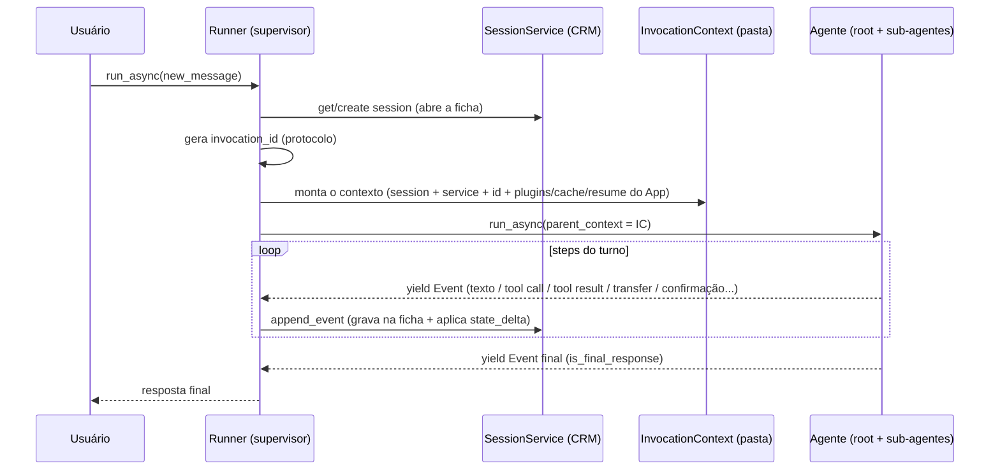

# O que faz um agente rodar no ADK — App, Runner, InvocationContext e eventos

---

## TL;DR — a página que resume tudo

Quando você "roda um agente" no ADK, **quatro peças** entram em cena:

| Peça | Analogia (central de atendimento) | O que é | Você precisa criá-la? |
|---|---|---|---|
| **`App`** | a **empresa** (nome + regras gerais) | molde declarativo da aplicação: `name`, `root_agent`, `plugins`, cache, resume, compaction | ⚠️ **Sempre existe em runtime** — se você não passar, o Runner **auto-cria** uma |
| **`Runner`** | o **supervisor** de cada atendimento | orquestra o turno: monta o contexto, **persiste eventos**, decide quem atende | ⚠️ na prática sim (sem ele você reimplementa tudo) |
| **`InvocationContext`** | a **pasta de trabalho** de um atendimento | o objeto efêmero que o agente recebe; carrega `session`, `session_service`, `invocation_id` | ✅ é **a** dependência real do agente |
| **`Session` + `SessionService`** | a **ficha do cliente** + o **CRM** que a guarda | os dados da conversa + onde eles são lidos/gravados | ✅ |

> ⚠️ **Cuidado com a palavra "obrigatório".** Há duas perguntas diferentes:
> - *"Um `App` precisa existir quando rodo?"* → **Sim, sempre** (se você usa um `Runner`).
>   O Runner **não roda sem um App**; passar só `agent=` faz ele **auto-criar** um por baixo
>   (`App.model_construct(...)`, `runners.py`). O App só **inexiste** no caminho cru de
>   montar o `InvocationContext` na mão, **sem** Runner.
> - *"Eu preciso escrever/instanciar o `App`?"* → **Não** no caso simples (auto-criado);
>   **sim** quando quer ligar plugins, resume, cache ou compaction (ver Parte 5).
>
> Por isso a coluna acima pergunta **"você precisa criá-la?"**, não "ela é obrigatória".

A frase que destrava tudo: **o agente não pede um `App` nem um `Runner` — ele pede um
`InvocationContext`.** App e Runner existem para **construir e alimentar** esse contexto a
cada turno. Você *pode* montar o contexto na mão (sem App nem Runner), mas aí reimplementa o
que o Runner faz de graça (persistir eventos, rotear turnos, resume, plugins…).

---

# Parte 1 — A intuição

## A analogia que vamos usar no guia inteiro

> **A Acme tem uma central de atendimento.**
>
> - A **empresa** (`App`) tem um **nome** e um **regulamento geral** que vale para todo
>   mundo (os _plugins_, o cache, a política de resume).
> - O **supervisor** (`Runner`) conduz cada atendimento: abre a **pasta de trabalho**,
>   registra tudo que acontece e decide **qual atendente** fala a cada momento.
> - A **ficha do cliente** (`Session`) guarda o **histórico** da conversa e um **rascunho**
>   de anotações (o `state`). Ela vive **entre atendimentos**.
> - O **CRM** (`SessionService`) é onde as fichas ficam **arquivadas** — quem sabe
>   **abrir e salvar** cada ficha.
> - Cada **atendimento** (`Invocation`) é "uma pergunta do cliente → resposta final".
>   Ganha um **número de protocolo** (`invocation_id`).
> - Cada coisinha que acontece no atendimento (falou, consultou o sistema, transferiu a
>   ligação…) é um **registro** na ficha (`Event`).

Guarde esse mapa. Cada peça do ADK encaixa nele.

## Agente vs App vs Runner

> *"Um agente sempre está ligado a um App e a um Runner. Dá pra executar o agente
> direto, sem Runner e sem App?"*

A resposta curta é **"o agente nem conhece App nem Runner"**. Olhe o ponto de entrada dele:

```python
# BaseAgent.run_async  (base_agent.py)
async def run_async(self, parent_context: InvocationContext):
    ctx = self._create_invocation_context(parent_context)   # só COPIA o contexto recebido
    ...
# _create_invocation_context (base_agent.py)
invocation_context = parent_context.model_copy(update={'agent': self})
```

O agente recebe um **`InvocationContext`** e devolve **eventos** (`yield`). Ele não instancia
nada, não salva nada. Tudo que ele precisa para existir é **esse contexto**.

---

# Parte 2 — O que o agente realmente precisa: o `InvocationContext`

Se o agente só pede um `InvocationContext`, o que **esse** objeto exige? Olhando os campos
**obrigatórios** (sem valor padrão):

```python
# InvocationContext (invocation_context.py)
session_service: BaseSessionService   #  obrigatório
invocation_id:   str                  #  obrigatório
session:         Session              #  obrigatório
agent:           Optional[BaseAgent]  #  (preenchido na cópia)
```

Repare: **não existe campo `app`**. O `App` **não é** dependência do agente. O que é
inescapável é a tríade **`session` + `session_service` + `invocation_id`**. Vamos a cada uma.

## 2.1 `session` — a ficha do cliente (o **dado**)

É o registro durável da conversa:

```python
# Session (session.py:39)
id: str
app_name: str
user_id: str
state:  dict[str, Any]   # o "rascunho" chave/valor, compartilhado entre agentes e tools
events: list[Event]      # o HISTÓRICO completo
last_update_time: float
```

É daqui que o agente **lê o histórico** (`events`) para montar o prompt, e **lê/escreve o
rascunho** (`state`). A ficha **vive entre turnos** — vários atendimentos ao longo da vida
de uma mesma ficha.

> **Analogia:** a ficha do cliente que o atendente abre e que já tem tudo que aconteceu antes.

## 2.2 `session_service` — o CRM (o **onde**)

É o backend que **arquiva e recupera** fichas. O CRUD das sessions:

```python
# BaseSessionService (base_session_service.py)
create_session / get_session / list_sessions / delete_session
append_event(session, event)   # ← grava cada evento E aplica a mudança de state
```

A diferença para `session`: **a `session` é a ficha; o `session_service` é o arquivo** que
sabe abrir e salvar muitas fichas. Implementações: `InMemorySessionService` (RAM),
`DatabaseSessionService`, `VertexAiSessionService`.

> 💡 **Por que é obrigatório?** Lembre que o agente **só emite** eventos — ele **não
> persiste**. Quem chama `append_event` para gravar é o `session_service`. Sem ele, o que o
> agente produziu não tem onde ser salvo, e não há como recarregar o histórico no próximo turno.

## 2.3 `invocation_id` — o número do protocolo (o **quando/qual turno**)

Identifica **um atendimento**: começa numa mensagem do usuário e termina na resposta final;
pode envolver **vários agentes** (se houver transfer). É **readonly** e gerado no início de
cada turno.

> **Anatomia de uma invocação** (do docstring do próprio `InvocationContext`):
> ```
> ┌───────────────────── invocation (1 protocolo) ─────────────────────┐
> ┌──────── agent_call_1 ────────┐ ┌─ agent_call_2 (após transfer) ─┐
> ┌── step_1 ──┐ ┌── step_2 ──┐
> [call_llm][call_tool][call_llm][transfer]
> ```

Um `transfer_to_agent` **não** muda o `invocation_id` — troca o **atendente**, não o
**atendimento**. O protocolo serve para **agrupar/tracejar** tudo de um turno e dá base ao
**rewind** ("desfaça até antes do protocolo X").

---

# Parte 3 — Eventos: o que o agente produz

O agente **devolve eventos**. Mas o que é um evento, e quantos existem por turno?

## 3.1 Cardinalidade: **1 protocolo → N eventos**

Cada `Event` carrega **um** `invocation_id` (`event.py`). Um turno gera **vários**
eventos:

```
invocation_id  1 ────< N  Event        (um-para-muitos)

Session.events = [ ev, ev, ev, | ev, ev, | ev, ev, ev, ... ]
                  └ protocolo A ┘└ prot.B ┘└  protocolo C  ┘
```

Por que vários por turno? Porque um atendimento se desdobra em **agent calls → steps**, e
cada passo emite eventos: a mensagem do usuário, as respostas do modelo, cada chamada de
ferramenta e seu resultado, e — se houver transfer — os eventos do outro agente (no
**mesmo** protocolo).

| Relação | Cardinalidade |
|---|---|
| `Session` → protocolos (`invocation_id`) | 1 : N |
| `invocation_id` → `Event` | 1 : N |
| `Event` → `invocation_id` | N : 1 (cada evento tem **um**) |

## 3.2 Não existe "enum de tipos": um evento é o que ele **carrega**

No ADK, `Event` é **uma classe só** (`event.py`). "Que tipo é" se descobre lendo **(a) o
conteúdo** e **(b) as `actions`**. A doc oficial resume:
*"captures user messages, agent replies, requests to use tools, tool results, state changes,
control signals, and errors."*

**Por CONTEÚDO** (o que foi dito/produzido):

| Evento | Como se reconhece |
|---|---|
| Texto completo | `content.parts[0].text` e `partial` falso |
| Chunk de streaming | `event.partial == True` |
| **Tool Call** (pedido de tool) | `event.get_function_calls()` não vazio |
| **Tool Result** (resultado) | `event.get_function_responses()` não vazio |
| Execução de código | `executable_code` / `code_execution_result` |
| Raciocínio (thought) | parts com `thought=True` |
| Mensagem do usuário | `author == 'user'` |

**Por AÇÃO** (`event.actions`, `event_actions.py`) — os sinais de controle:

| `actions.…` | Significa |
|---|---|
| `state_delta` | atualização do `state` |
| `artifact_delta` | artefato salvo / versão |
| `transfer_to_agent` | handoff de controle |
| `escalate` | escalar / sair de loop |
| `requested_tool_confirmations` | **HITL** — pedido de confirmação |
| `requested_auth_configs` | tool pedindo credencial |
| `skip_summarization` | não sumarizar a resposta da tool |
| `set_model_response` | saída estruturada (fechamento do `single_turn`) |
| `compaction` | compactação de histórico |
| `end_of_agent` / `agent_state` | fim de run / checkpoint (workflow) |
| `rewind_before_invocation_id` | evento de rewind |
| `route` | roteamento de aresta (workflow) |
| `render_ui_widgets` | widgets de UI |

**Flags especiais** no `Event`: `long_running_tool_ids` (function call de longa duração — base
do HITL), `partial` (streaming), `is_final_response()` (resposta final), `output`+`node_info`
(saída de nó de workflow), e os campos de **erro** (herdados de `LlmResponse`).

---

# Parte 4 — O `Runner`: o supervisor do turno

Se o agente só emite eventos e não persiste nada, **quem faz o resto?** O `Runner`. Ele é a
**camada de orquestração de turno**. A cada `run_async`, ele:

1. **Abre/recupera a ficha** (`session`) no CRM;
2. **Monta a pasta de trabalho** (`InvocationContext`) — gera o `invocation_id`, injeta
   serviços e configs;
3. **Roda o agente** e, conforme os eventos saem, **persiste** cada um (`append_event`);
4. **Decide qual agente atende** a cada turno — `_find_agent_to_run` (resume, transfer,
   fallback para o root);
5. Cuida de `run_config`, ciclo de **plugins**, limpeza de sessões MCP, etc.

> **É por isso que "rodar sem Runner" é possível, mas custoso:** você teria que montar o
> `InvocationContext` na mão **e** assumir tudo isso (persistir eventos, rotear turnos,
> resume…). O caminho leve de verdade é o **`InMemoryRunner(agent)`** — continua sendo um
> Runner, mas com serviços em memória e zero infra.

> 💡 Os **sub-agentes já rodam "sem Runner próprio"** o tempo todo: recebem o
> `InvocationContext` **do pai** (`run_async(parent_context=ctx)`). Existe **um único Runner
> na raiz** que criou o contexto.

---

# Parte 5 — O `App`: por que embrulhar o `root_agent`?

Chegamos à pergunta-chave. Se o agente nem usa o `App`, **por que ele existe?**

## 5.1 App e InvocationContext **não são alternativas** — são camadas

- O **`App`** é o **molde declarativo da aplicação** (config que vale para a árvore inteira).
- O **`InvocationContext`** é a **instância por-turno**, que o Runner **constrói a partir do App**.

Você não "passa um em vez do outro": o contexto é **derivado** do App.

```
App  (blueprint: nome + plugins + cache + resume + compaction)
 │
 └─ Runner lê o App e, a CADA turno, cria um ───────────────┐
     InvocationContext (efêmero, semeado com os configs do App)
      └─ model_copy() propaga para cada sub-agente
```

## 5.2 O que o `App` carrega

```python
# App (apps/app.py)
name:  str                       # identidade validada (regex; proíbe 'user')
root_agent: BaseAgent|BaseNode   # ponto de entrada
plugins: list[BasePlugin]        # componentes APP-WIDE
events_compaction_config         # compactação de histórico (app inteiro)
context_cache_config             # "applies to ALL LLM agents in the app"
resumability_config              # "applied to ALL agents in the app"
```

Os comentários da própria fonte entregam o ponto: cache e resumability **valem para TODOS os
agentes da app**.

## 5.3 Como isso vira vantagem: o Runner injeta tudo em cada contexto

No `__init__`, o Runner lê os campos do App (`runners.py`) e, **em toda invocação**,
semeia o contexto com eles (`runners.py`):

```python
self.plugin_manager = PluginManager(plugins=app.plugins)   # 246
...
return self._create_invocation_context(
    plugin_manager=self.plugin_manager,            # plugins do App
    context_cache_config=self.context_cache_config, # cache do App
    events_compaction_config=app.events_compaction_config,
    resumability_config=self.resumability_config,   # resume do App
    ...)
```

E como `_create_invocation_context` faz `model_copy`, esses configs **propagam para toda a
árvore** de sub-agentes — sem você repassar nada.

| Campo do App | O que você ganha por estar no App |
|---|---|
| `plugins` | hooks transversais (`on_user_message`, before/after model/tool, lifecycle) aplicados **a toda a árvore**, num lugar só |
| `context_cache_config` | cache de prefixo **para todos os LlmAgents** de uma vez |
| `resumability_config` | **pausa/resume e checkpoint** (é o que liga o HITL) — chave única |
| `events_compaction_config` | compactação de histórico **app-wide** |
| `name` | identidade validada → namespaceia a ficha no CRM (`app_name + user_id + session_id`) |

## 5.4 E quando você passa só `agent=`?

O Runner **auto-embrulha** num App com defaults (`runners.py`):

```python
App.model_construct(name=app_name, root_agent=agent, plugins=[])
```

Ou seja: você ganha o caminho feliz, mas **sem plugins, sem resumability, sem cache, sem
compaction**. No instante em que você quer **qualquer** uma dessas capacidades app-wide,
**precisa** de um `App` de verdade — não há outro lugar para declará-las.

> **Vantagem do App em uma frase:** é o **único ponto declarativo** onde você liga
> capacidades que precisam valer **uniformemente para toda a árvore de agentes** (plugins,
> cache, resume, compaction) + a **identidade validada** da aplicação.

---

# Parte 6 — Juntando tudo: o ciclo de um turno



**Leitura do diagrama:**
- O **App** não aparece em runtime porque ele já foi "diluído": seus configs viraram campos
  do `InvocationContext` no passo *"monta o contexto"*.
- O **agente** só faz `yield`; quem **grava** é o **Runner** via **SessionService**.
- Tudo entre `get/create session` e a resposta final compartilha **um** `invocation_id`.

---

# Apêndice A — Glossário

- **App** — molde declarativo da aplicação: `name`, `root_agent`, `plugins`, cache, resume,
  compaction. Vale para a árvore inteira. (`apps/app.py`)
- **Runner** — orquestrador do turno: monta o contexto, persiste eventos, decide quem atende.
  (`runners.py`)
- **InvocationContext** — objeto efêmero (1 por turno) que o agente recebe; carrega `session`,
  `session_service`, `invocation_id` e os configs do App. (`invocation_context.py`)
- **Session** — a ficha da conversa: `events` (histórico) + `state` (rascunho) + identidade.
  Vive entre turnos. (`session.py`)
- **SessionService** — o repositório (CRM) que abre/salva fichas; `append_event` grava.
  (`base_session_service.py`)
- **Invocation** — um turno: "mensagem do usuário → resposta final"; pode envolver vários
  agentes. Identificada pelo `invocation_id`.
- **Event** — registro imutável de um ponto da execução; "tipo" = conteúdo + `actions`.
  (`event.py`)
- **EventActions** — sinais de controle anexados a um evento (state, transfer, confirmação,
  set_model_response…). (`event_actions.py`)

# Apêndice B — Perguntas frequentes

**Dá para rodar o agente sem Runner e sem App?**
Tecnicamente sim: monte um `InvocationContext` na mão (com `SessionService` + `Session` +
`invocation_id`) e chame `agent.run_async(ctx)`. Mas você perde o que o Runner faz de graça —
persistir eventos, rotear turnos, resume, plugins. Para experimentos, use `InMemoryRunner(agent)`.

**Preciso construir um App manualmente?**
Não para o caso simples — passar `agent=` ao Runner auto-embrulha num App com defaults. Você
**só** precisa de um App explícito para ligar **plugins, resumability, context cache ou
compaction**.

**O `invocation_id` muda quando há transfer?**
Não. Transfer troca o **agente ativo**, não o **turno**. O `invocation_id` é o mesmo até a
resposta final.

**Onde os eventos são gravados?**
O agente só os **emite**. O **Runner** chama `session_service.append_event` para gravar cada
um na `Session` (e aplicar o `state_delta`).
